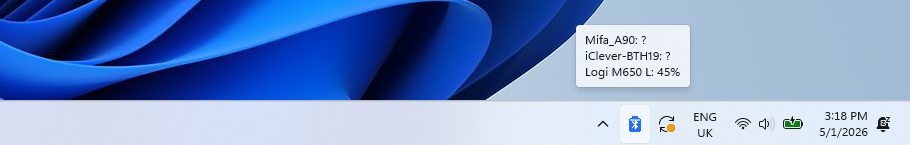

# 🔋Peripheral Battery Monitor



## Introduction
Peripheral Battery Monitor adds a small and simple battery display to your system tray, so you can see the remaining life of any wireless devices connected to your PC at a glance.

It supports :
  - **Bluetooth Low Energy (BLE)** devices (earbuds, fitness bands, modern headsets, BLE mice/keyboards)
  - **Bluetooth Classic (BR/EDR)** devices (older headsets, gaming headsets, AirPods on Windows)
  - **Apple magic mice/trackpads/keyboards** devices
  - **Logitech LIGHTSPEED** devices (PRO X Wireless headset, ...).

**Notifications**
Whenever a device drops below 20% a balloon notification fires (once per device, per low-battery transition).

**Auto Startup**
When activated, the application starts automatically at Windows logon.

**Adjustable Refresh Rate**
Configure how often the app polls battery levels (1 min – 24 h).

**One tray icon per device**
Optionally show a separate tray icon for every paired device instead of one aggregate icon for the lowest battery. Each icon displays its own battery glyph and tooltip.

**Hide unknown-battery devices**
Optionally hide devices whose battery cannot be read from the tray, balloon tooltip and Info popup.

## Quick Start Guide
Follow the directions below to get started!

**Step 1.** Download `PeripheralBatteryMonitor.exe` from the [latest release](https://github.com/o0Zz/PeripheralBatteryMonitor/releases).

**Step 2.** Double-click `PeripheralBatteryMonitor.exe` to start it.

**Step 3.** Open the system tray overflow popup and locate the battery icon. Drag it to the visible tray area if you want it always shown.

**Step 4.** Double-click the icon to see the per-device list, or right-click for *Settings* / *Exit*.

*Auto-start is off by default — enable it in Settings if you want the app to launch with Windows.*

## ⚙️Settings and Configuration⚙️

### How to Access Settings
When the application is running, right-click the battery icon in the system tray and select *Settings*. All changes apply immediately — no restart required.

### Settings Breakdown

- [ ] **Launch application on startup**
  - *[Off by default]* Boot the application automatically when Windows starts.

- [x] **Enable notifications**
  - When a device drops below 20%, a balloon notification is shown (once per low-battery transition).

- [x] **Automatically detect new devices (If unchecked, detect device only during startup)**
  - When checked, the app keeps watching for newly paired devices. When unchecked, it only enumerates devices that were already paired when the app started.

- [ ] **Show one tray icon per device**
  - *[Off by default]* When checked, each paired device gets its own tray icon with its own battery glyph and tooltip. When unchecked, a single tray icon shows the lowest battery across all devices and a multi-line tooltip listing each device.

- [ ] **Hide devices with unknown battery level**
  - *[Off by default]* When checked, devices whose battery can't be read (showing `?` / `-1%`) are hidden from the tray icons, the balloon tooltip and the Info popup.

- [x] **Refresh period [5 min default]**
  - How often the application polls battery levels for every tracked device.

## 🔧Troubleshooting🔧

- **Battery icon not in system tray**
  - Check the system tray overflow / pop-up area
  - Manually start the application again
    > On first startup the icon usually appears in the overflow flyout, not the main tray. Drag it to the main tray to keep it visible. If it's nowhere to be found, the application may have failed to start — try launching it again.

- **Battery shows `-1%` or `?`**
  - Wait for the next refresh tick and check again
  - Some devices simply don't report battery to Windows
    > The app polls every 5 min by default. A newly paired device will show as unknown until the first poll completes. If a device still reports nothing after several refreshes, it likely doesn't expose battery via any API Windows can read — enable **Hide devices with unknown battery level** in Settings to suppress it from the UI.

- **Bluetooth Classic device not appearing**
  - Make sure the device is paired in Windows Settings → Bluetooth & devices
  - Make sure the device is currently connected (powered on)
    > Only paired devices are tracked. Unpaired devices won't be picked up. Battery for Classic devices depends on Windows itself surfacing the value through device properties, which not every driver does.

- **Not auto-starting on system startup**
  - Confirm *Launch application on startup* is checked in Settings
  - Verify the entry is enabled in Task Manager → Startup tab
    > Auto-start is off by default. Enable it in Settings. If it's still not running on logon, Task Manager may have disabled the startup entry — re-enable it there.

- **Not sending low-battery notifications**
  - Confirm *Enable notifications* is checked in Settings
  - Make sure Windows Focus Assist / Do Not Disturb isn't suppressing balloons
  - Exit and restart the application if the problem persists
    > A notification fires once per low-battery transition (when a device drops to ≤ 20% after being above it). It won't repeat every refresh while the device stays low.

- **Duplicate tray icons**
  - Exit any extra instances and start the application once
    > Running the app twice produces two sets of icons. Right-click each tray icon → *Exit*, then start a single instance. Note: the *Show one tray icon per device* setting intentionally creates one icon per device — that's not a duplicate.

## Build from source

Requires only the [.NET SDK](https://dotnet.microsoft.com/download) (8.0 or newer). The solution targets .NET Framework 4.8, but both projects are SDK-style and the reference assemblies come from a NuGet package, so no Visual Studio, no targeting pack and no `nuget.exe` are needed.

```sh
dotnet build PeripheralBatteryMonitor.sln -c Release
```

The built executable is `src/PeripheralBatteryMonitor.App/bin/Release/net48/PeripheralBatteryMonitor.exe` — still a single file: `PeripheralBatteryMonitor.Core.dll` is embedded inside it.

### Layout

```
src/PeripheralBatteryMonitor.Core/   device discovery and battery reading. No UI.
src/PeripheralBatteryMonitor.App/    WinForms tray icon, Settings and Info windows.
```
